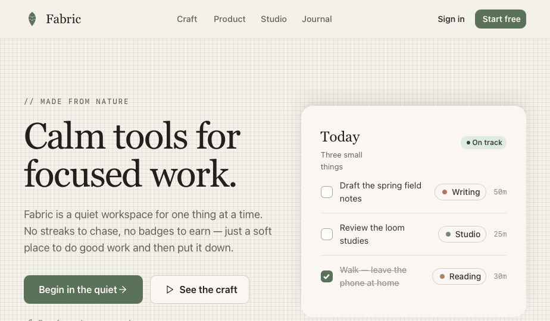
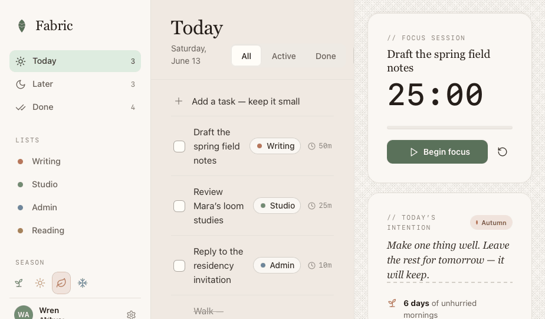

# Fabric — Design System

> **Calm tools for focused work.** · *Made from nature.*


**Fabric** is a design system that embraces nature and human characteristics. Its materials resemble things found in — or made from — nature: linen, lichen, clay, dried grass, the grain of old paper. The palette is deliberately **muted** so the interface recedes and the user can feel calm and stay focused. Three humanist typefaces, a soft organic shape language, a warm-earth dark theme (**Nightfall**), and an optional **seasons** layer that turns the year through accent + texture.

The flagship product, also called Fabric, is a quiet daily workspace for doing one thing at a time.

<p align="center">
  
</p>
<p align="center">
  
</p>

---

## Browse it visually

After cloning, you can review the whole system in one page — no special tooling.
The repo root ships an **`index.html` visual catalog** that renders every foundation
card, component, UI kit and template as a live, grouped preview, with Theme
(Auto / Light / Nightfall) and Season toggles.

Three ways to open it, easiest first:

1. **Double-click `index.html`.** It carries an embedded snapshot of the catalog,
   so every tile renders straight off disk — no terminal. (Browsers won’t let a
   file-opened page retint the previews from the toggle; each tile follows your
   OS light/dark setting. The page chrome still toggles.)
2. **Share a link via GitHub Pages.** A deploy workflow ships in
   `.github/workflows/pages.yml`. One-time: **Settings → Pages → Source: GitHub
   Actions**. Every push then publishes to
   `https://nexxspace-development.github.io/fabric-design-system/` — reviewers
   open it in one click, toggles drive every preview, and it auto-syncs.
3. **Serve locally** for the full live experience from a clone:

   ```bash
   git clone https://github.com/Nexxspace-Development/fabric-design-system.git
   cd fabric-design-system
   python3 -m http.server 8000      # or: npx serve .
   # then open http://localhost:8000/
   ```

Served over HTTP (2 or 3) the catalog re-reads `_ds_manifest.json` live, so it
stays in sync as the system grows. The catalog’s own “How to use” panel repeats
these steps for anyone you share it with.

---

## Quick start

Link the single stylesheet, then (for the React components) load the compiled bundle after React UMD:

```html
<!-- 1. Tokens, fonts, base — the one file consumers link -->
<link rel="stylesheet" href="styles.css" />

<!-- 2. React UMD (only if you use the components) -->
<script src="https://unpkg.com/react@18.3.1/umd/react.development.js"></script>
<script src="https://unpkg.com/react-dom@18.3.1/umd/react-dom.development.js"></script>

<!-- 3. The compiled component bundle -->
<script src="_ds_bundle.js"></script>
<script>
  const { Button, Card, Tag, Tabs } = window.FabricDesignSystem_7bb975;
  // …render with React
</script>
```

Plain HTML/CSS works with **no JavaScript** — every token and the `.fabric-*` texture/eyebrow utilities come from `styles.css` alone:

```html
<span class="fabric-eyebrow">// made from nature</span>
<button style="background: var(--primary); color: var(--text-on-sage);
               border-radius: var(--radius-md); padding: 10px 16px; border: 0;">
  Begin in the quiet
</button>
```

**Theme & season** are attributes on `<html>` (both optional, both compose):

```html
<html data-theme="dark" data-season="autumn">
```

`data-theme` → `light` / `dark` (defaults to the OS via `prefers-color-scheme`).
`data-season` → `spring` / `summer` / `autumn` / `winter` (defaults to spring).

---

## What's inside

```
fabric-design-system/
├── index.html            # ← visual catalog: browse every card + template (double-click, or serve)
├── .github/workflows/    # GitHub Pages deploy workflow for the catalog
├── styles.css            # single entry — @imports every token + base file
├── tokens/               # colors · typography · spacing · textures · dark · seasons · fonts · base
├── components/           # React primitives — forms · feedback · layout · navigation
├── ui_kits/              # full product recreations — app (workspace) · site (landing)
├── guidelines/           # foundation specimen cards (the Design System tab)
├── templates/            # copy-to-start pages (Fabric page)
├── assets/               # leaf mark · screenshots
├── compare/              # side-by-side option explorations
├── SKILL.md              # Agent Skill manifest (use Fabric from Claude Code)
├── CHANGELOG.md
└── README.md             # you are here
```

> **Generated — do not hand-edit:** `_ds_bundle.js`, `_ds_manifest.json`, `_adherence.oxlintrc.json`. A compiler rebuilds these from the source files above; edit the sources and they regenerate.

---

## Sources
This system was authored from a written brand brief — **no codebase, Figma, or existing assets were provided.** All visual decisions (type pairing, color, motifs, the leaf mark) are original, made to fit the brief. If you have brand assets (real logo, fonts, photography, product screens), share them and we'll replace the originals here and flag what changed.

---

## Content fundamentals
How Fabric writes.

- **Voice:** calm, plainspoken, quietly warm. We sound like a thoughtful studio-mate, never a hype-y app. Unhurried.
- **Person:** address the reader as **you**; the company is **we**. ("A quiet place to do one thing at a time.")
- **Casing:** **sentence case** everywhere — headings, buttons, labels. Never Title Case UI. The only uppercase is the tracked mono **eyebrow** (e.g. `// MADE FROM NATURE`).
- **Punctuation:** real typographer's quotes (" ' ' ") and en/em dashes. Periods on full marketing sentences; none on UI labels.
- **Length:** short. One idea per line. Whitespace is a feature.
- **Tone examples:**
  - Empty state: *"Nothing here. Enjoy the quiet."*
  - Intention: *"Make one thing well. Leave the rest for tomorrow — it will keep."*
  - CTA: *"Begin in the quiet."* / *"Enter your studio."*
  - Reassurance: *"No streaks, no nagging."*
- **Avoid:** urgency ("Hurry!", "Don't miss"), gamification language (streaks framed as pressure), exclamation marks, jargon, emoji.
- **Emoji:** not used. Anywhere.
- **Metaphor bank:** nature & craft — linen, weave, loom, grain, clay, dye, lichen, field notes, mornings, growth. Use sparingly and literally; don't overwrought it.

---

## Visual foundations

**Color.** A muted, nature-derived palette defined in OKLCH at low chroma. Backbone neutral is **stone** (warm linen → bark). Primary is **sage** (muted moss). Warm accents are **terracotta** (fired clay) and **ochre** (dried grass/honey); the cool accent is **marsh** (still water). Danger is **rust** — earthen, never an alarming pure red. Nothing is saturated. Light, warm paper surfaces; ink is warm near-black, never pure `#000`. See `tokens/colors.css`.

**Type.** Three humanist families. *Newsreader* (serif) carries all display, headlines, and quotes — warm, literary, calm. *Hanken Grotesk* (sans) is the steady UI/body voice. *IBM Plex Mono* handles eyebrows, numerals, code, and data labels. Display is set tight (`-0.02em`) at weight 400–500; body at 400/500/600; the mono eyebrow is uppercase, tracked `0.16em`, prefixed `//`. See `tokens/typography.css`.

**Spacing & layout.** 4px base grid. Generous, breathing layouts — whitespace is part of the calm. Readable prose capped at ~42rem. See `tokens/spacing.css`.

**Radii.** Soft and organic: controls `10px`, cards `20px`, hero surfaces `28px`, pills for tags/switches. Nothing hard-cornered.

**Backgrounds.** Warm paper canvas. A subtle woven texture (see **Texture** below) can sit under heroes and calm surfaces — barely perceptible, like light on cloth. **No gradients** (especially no blue/purple gradients), no photographic hero washes by default. One alternate background only: the dark **bark** band (`--surface-inverse`, or the fixed `--stone-900` for always-dark moments) for philosophy/quote sections.

**Texture.** Fabric is cloth, so its surfaces are *woven and grained, not flat* — but the texture is felt more than seen, so the interface still recedes. A small family of gradient-built, theme-aware utilities (no image assets) keyed to the flipping `--texture-ink` token: `.fabric-weave` (default linen cross-hatch), `.fabric-linen` (finer/denser), `.fabric-grain` (cold-press paper tooth), `.fabric-ribbed` (directional thread, for accent/CTA panels), `.fabric-felt` (dense matte wool), `.fabric-frost` (crystalline crosshatch), and `.fabric-stitch` (a dashed running-stitch thread, also a `Divider variant="stitch"`). Rules of use: **one texture per surface** (never stack), reserve them for large calm areas (canvases, heroes, empty states, dark bands, marketing/login panels) and keep dense working UI (task rows, forms, tables) clean. Because `--texture-ink` flips with theme, textures read on warm paper and on Nightfall's dark earth; for an *always-dark* surface, override `--texture-ink` locally to a light fleck so the grain still shows. **Intensity** is set to the "Linen" weight (`--texture-ink` alpha ≈ 0.09) — clearly tactile up close, still quiet under text; dial `--texture-ink` / `--texture-ink-strong` globally or per-surface to go softer ("Whisper", ≈0.05) or louder ("Canvas", ≈0.14). See `tokens/textures.css` and the **Texture** card in the Brand group.

**Seasons.** A gentle seasonal layer, *orthogonal* to light/dark — set `data-season="spring|summer|autumn|winter"` on `<html>` for the whole product, or on any single element to season just one banner/section. A season does **not** repaint the UI; it rotates three things only: a **seasonal accent** (drawn from Fabric's existing families — spring→sage, summer→ochre, autumn→terracotta, winter→marsh) exposed as `--season-accent` / `--season-accent-soft` / `--season-on-soft`; a **signature texture** you apply to surfaces (spring→`.fabric-weave`, summer→`.fabric-ribbed`, autumn→`.fabric-felt`, winter→`.fabric-frost`); and a **canvas whisper** (`--season-canvas`) — the page background with a ~5–6% breath of the season's accent mixed in, warm in autumn, cool in winter. All are derived with `color-mix` against the current surface/ink, so a season composes with Nightfall (light *and* dark) with no per-theme duplication. Seasons are a whisper — keep the sage primary and neutral core constant so the product stays recognizably Fabric year-round. See `tokens/seasons.css` and the **Seasons** card in the Brand group.

**Shadows.** Warm-tinted (bark hue at low alpha), soft and diffuse — `xs`→`xl` plus an `inset` well for sunken tracks. Never hard or neutral-gray. Cards combine a hairline border with a small shadow.

**Borders.** Hairline (`1px`) dividers in `--border-subtle`; `1.5px` on inputs/controls. Dividers are quiet stone, never black.

**Cards.** Warm paper fill (`--surface-card`), hairline border, soft shadow, `20px` radius. Three elevations: `flat` (border only), `raised` (default), `floating` (overlays).

**Motion.** Calm and brief. Ease-out `cubic-bezier(0.22,0.61,0.36,1)`; durations 120–320ms. Fades and gentle slides — **no bounce, no spring, no infinite loops.** Honors `prefers-reduced-motion`.

**Hover / press.** Hover = a small shift in fill (primary → `--primary-hover`, ghost → faint stone tint) or a 1px lift on interactive cards. Press = a barely-there scale-down (`0.99` on buttons, `0.93` on icon buttons) and a darker fill (`--primary-press`). Never color-flips that feel jumpy.

**Focus.** A 2px solid `--focus-ring` (sage) outline at 2px offset, plus a soft `3px` tinted ring inside inputs. Always visible, never removed.

**Transparency & blur.** Used sparingly: the marketing nav uses a translucent canvas + `backdrop-filter: blur` when stacked over the hero. Otherwise surfaces are opaque paper.

**Imagery vibe (when added).** Warm, natural light; earthy, desaturated; matte not glossy; a hint of grain. Cool/clinical or high-saturation imagery is off-brand. (No stock photography is bundled — add real materials and we'll place them.)

**Dark theme — “Nightfall.”** Night, still grounded in nature: not a cold blue-black but **warm dark earth** — loam, bark and peat for surfaces, **moonlight on linen** for ink, and a **luminous moonlit moss** for the primary. Only the *semantic* layer changes (the base OKLCH scales stay put), so every component flips for free. It applies automatically under `prefers-color-scheme: dark`, and can be forced either way with `<html data-theme="dark">` / `data-theme="light">` (the attribute wins over the OS). Soft fills invert to deep tints with light ink via the `--on-*-soft` tokens; switches/controls flip through `--control-track` / `--control-thumb` / `--hover-wash`; tooltips and inverse chrome flip through `--surface-inverse` / `--text-on-inverse`. Deliberately *constant* dark moments (e.g. the site's philosophy band, built on the fixed `--stone-900` scale step) stay dark in both themes, like a forest at dusk. See `tokens/dark.css` and the **Nightfall** card in the Colors group.

---

## Iconography
- **Set:** [Lucide](https://lucide.dev) — chosen for its calm, humanist, **thin rounded stroke** (1.75px default here), which matches Fabric's gentleness. **Substitution flag:** no proprietary icon set existed in the brief, so Lucide is the closest-fit standard. Swap if you adopt a house set.
- **Delivery:** loaded from CDN (`unpkg.com/lucide`). In React contexts we render Lucide's icon-node data as **inline SVG** via a small `<Icon name="…" />` helper (`ui_kits/*/icons.jsx`) to avoid DOM-swap issues. Foundation cards use Lucide's own `<i data-lucide>` + `lucide.createIcons()`.
- **Sizing:** 18–20px inline with text/controls; 22–26px for feature chips. Stroke 1.75 (occasionally 2 for tiny sizes). Color via `currentColor`.
- **Usage:** functional, never decorative clutter. One icon per action. Pair an icon with a label wherever space allows.
- **No emoji, no unicode-symbol icons.** The leaf brand mark (`assets/fabric-mark.svg`) is bespoke, not from Lucide.

---

## Index / manifest

**Global entry**
- `styles.css` — the one file consumers link (imports the tokens + base below).

**Tokens** (`tokens/`)
- `fonts.css` — `@import` of the three Google Fonts.
- `colors.css` — OKLCH scales (stone, sage, terracotta, ochre, marsh, rust) + semantic aliases.
- `typography.css` — families, type scale, weights, leading, tracking.
- `spacing.css` — spacing grid, radii, borders, shadows, motion, z-index, widths.
- `base.css` — element defaults, `.fabric-eyebrow`, reduced-motion.
- `textures.css` — surface texture utilities (`.fabric-weave/-linen/-grain/-ribbed/-felt/-frost/-stitch`).
- `dark.css` — **Nightfall** dark-theme semantic overrides (`prefers-color-scheme` + `[data-theme]`).
- `seasons.css` — seasonal accent + signature-texture + canvas-whisper layer (`[data-season]`), composes with light/dark.

**Components** (`components/`, namespace `window.FabricDesignSystem_7bb975`)
- `forms/` — **Button, IconButton, Input, Textarea, Select, Checkbox, Switch**
- `feedback/` — **Badge, Tag, Tooltip, Toast**
- `layout/` — **Card, Avatar, Divider**
- `navigation/` — **Tabs**
- Each has `<Name>.jsx`, `<Name>.d.ts`, `<Name>.prompt.md`; each directory has a `*.card.html` specimen.

**UI kits** (`ui_kits/`)
- `app/` — **Fabric workspace** (login → today/later/done, lists, focus timer, theme + season switchers). See `app/README.md`.
- `site/` — **Fabric landing page** (hero, features, philosophy band, CTA, footer). See `site/README.md`.

**Foundation specimens** (`guidelines/`) — the `*.card.html` files behind the Design System tab (Type, Colors, Spacing, Brand).

**Templates** (`templates/`) — `page/` is a copy-to-start Fabric page.

**Brand** (`assets/`)
- `fabric-mark.svg` — the leaf mark. · `screenshots/` — README imagery.

**Other**
- `SKILL.md` — Agent-Skill manifest for using Fabric in Claude Code.
- `CHANGELOG.md` — version history.

### Generated (do not edit)
`_ds_bundle.js`, `_ds_manifest.json`, `_adherence.oxlintrc.json`.

---

## License
Proprietary — © 2026 Nexxspace Development. All rights reserved. *(Replace this section with your preferred license, e.g. MIT, if you intend to open-source it.)*
